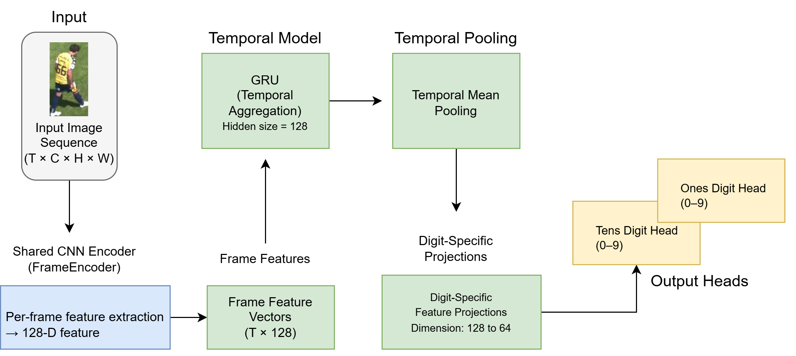
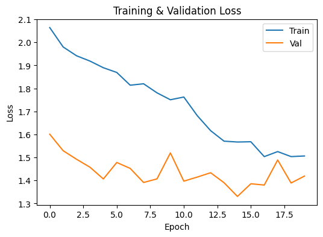

# Temporal Jersey Number Recognition

This repository implements a lightweight temporal computer vision model for recognizing jersey numbers from sequences of player bounding-box images. The system produces a single, stable prediction per sequence and is designed to generalize to unseen two-digit numbers (00–99).

---

## Approach

- Input is a temporal sequence of bounding-box images for a tracked player.
- A shared CNN extracts visual features from each frame.
- A GRU aggregates features over time to handle blur, occlusion, and motion.
- Two independent digit heads predict the tens and ones digits, enabling compositional generalization.

---

## Model Architecture

The model processes a sequence of player bounding-box images using a shared CNN, aggregates temporal information via a GRU, and predicts jersey numbers using independent digit classifiers.

---

## Training Behavior

Training and validation losses remain closely aligned, indicating controlled generalization and minimal overfitting for the lightweight temporal model.

---

## Dataset Notes

- Each sample corresponds to a sequence of images from a tracked player.
- Training and evaluation are performed at the sequence level.
- Anchor frames are excluded during inference to avoid bias.

---

## Evaluation

Reported metrics:
- Tens digit accuracy
- Ones digit accuracy
- Full number (sequence-level) accuracy

Evaluation is performed on a held-out test set that remains completely unseen during training.

---

## Notes

- Lightweight model (~200k parameters).
- Designed for low latency and scalability.
- Temporal modeling significantly improves stability over single-frame prediction.
